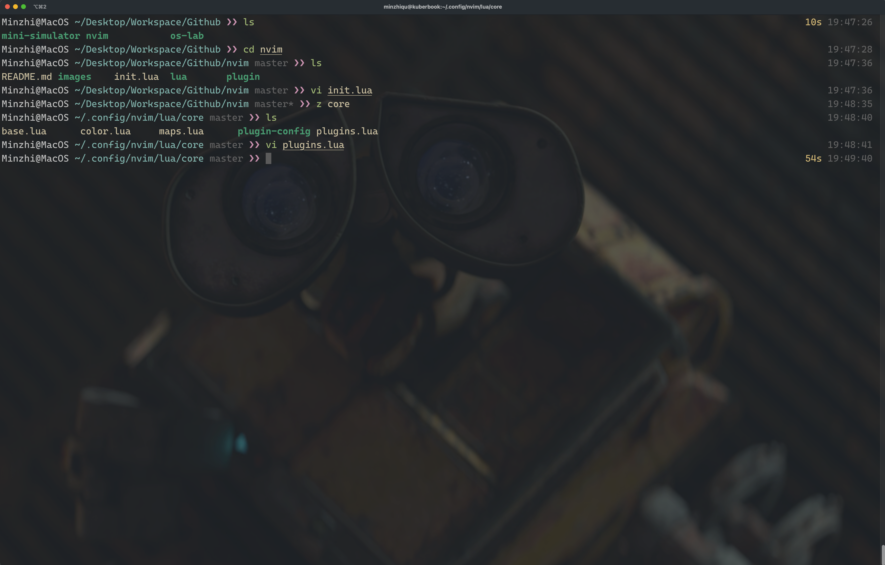
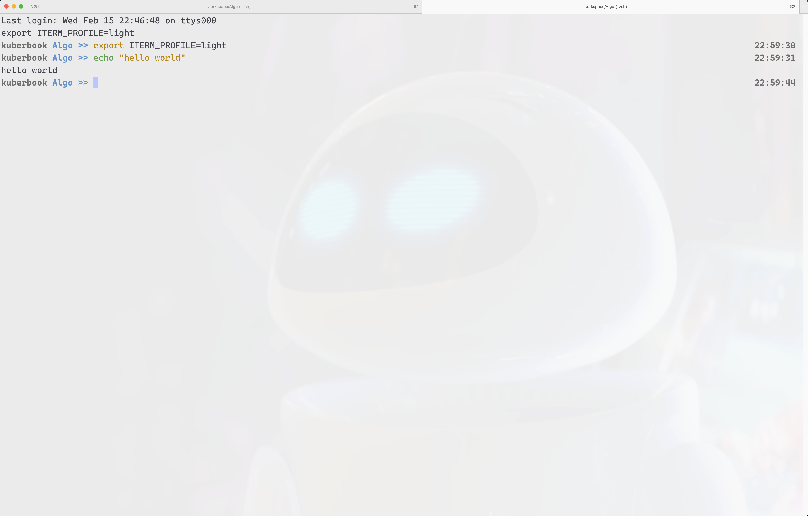
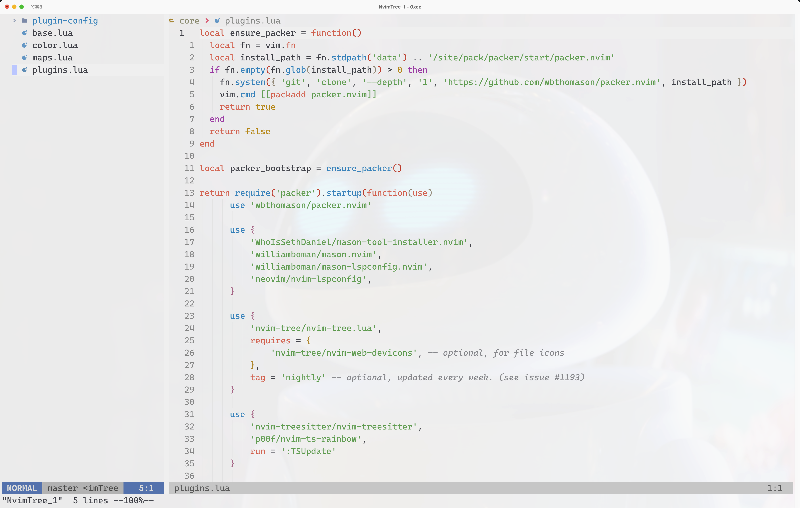
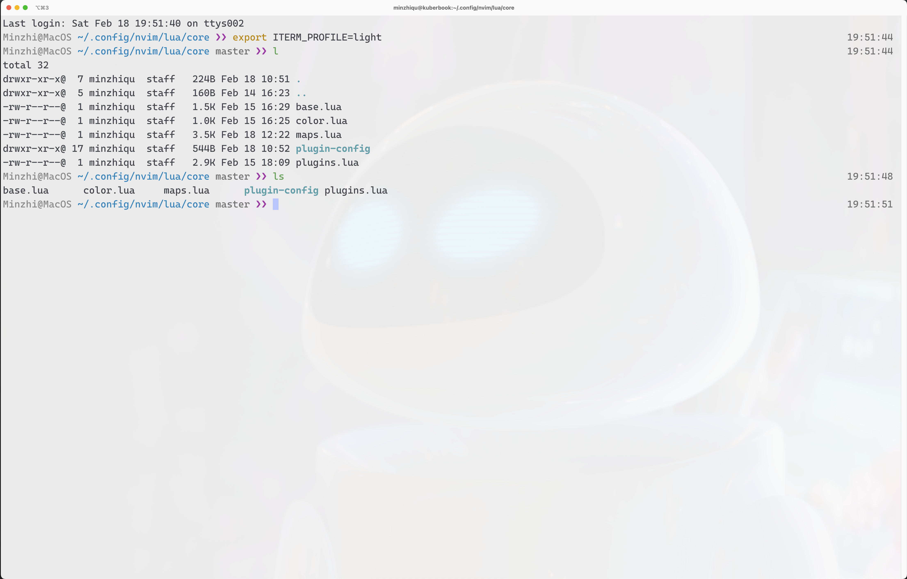

# Editor Configuration

## Components

Components:

- iterm2
- neovim
- lua runtime

Lua configure is listed in this repository.

## Demo

Here are screenshots for my configuration.

- dark theme

- light theme

contact: quminzhi@gmail.com
location: SEA, WA
